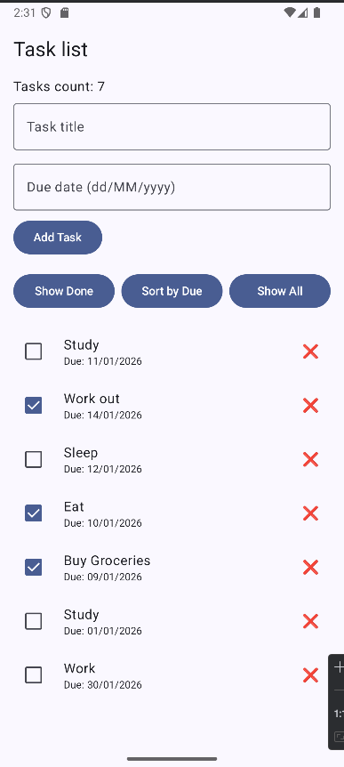
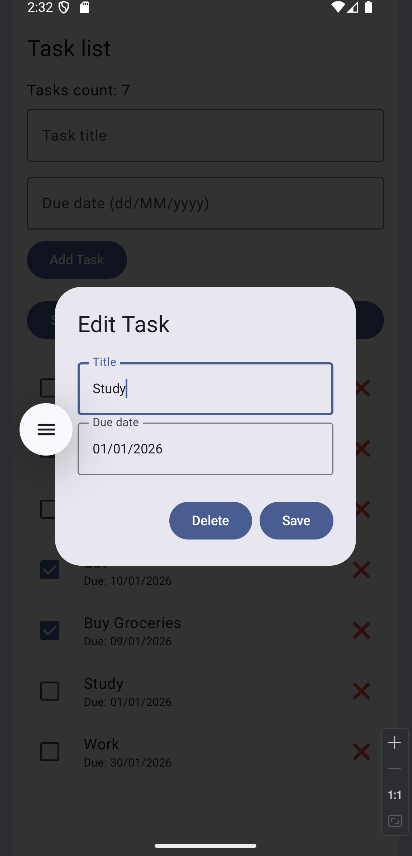

# Viikko 3 – MVVM-arkkitehtuuri

## Yleiskuvaus
Tämä projekti on jatkoa **Viikon 2 Task Manager -sovellukselle**, ja siinä on toteutettu **MVVM-arkkitehtuuri** käyttäen **Jetpack Composea** ja **StateFlow’ta**.

MVVM jakaa sovelluksen kolmeen kerrokseen:

1. **Model** – Vastaa datasta (`Task`-luokka `model`-paketissa)
2. **ViewModel** – Hallitsee käyttöliittymän tilaa ja sisältää sovelluksen liiketoimintalogiikan (`TaskViewModel`)
3. **View** – Composables-komponentit, jotka näyttävät datan ja mahdollistavat käyttäjän vuorovaikutuksen (`HomeScreen`, `TaskDetailDialog`)

Tämä rakenne tekee sovelluksesta **modulaarisen, helposti ylläpidettävän ja testattavan**, ja varmistaa, että käyttöliittymä päivittyy automaattisesti datan muuttuessa.

---

## Projektin rakenne

```
com.example.week3mvvm
├── model
│   └── Task.kt           # Task data class
├── view
│   ├── HomeScreen.kt     # Main task list UI
│   └── TaskDetailDialog.kt # Dialog for editing/deleting tasks
├── viewmodel
│   └── TaskViewModel.kt  # State management & task logic
```

---

## Ominaisuudet
- Tehtävien lisääminen, muokkaaminen ja poistaminen
- Tehtävien merkitseminen tehdyiksi / tekemättömiksi
- Tehtävien suodatus tehtyjen perusteella
- Tehtävien lajittelu eräpäivän mukaan
- Kaikkien tehtävien näyttäminen
- Reaktiivinen käyttöliittymä käyttäen `StateFlow`ta ja `collectAsState()`-funktiota Composessa
- Yksityiskohtainen dialogi tehtävien muokkaamiseen ja poistamiseen

---

## Tilan hallinta (State Management)
`ViewModel` tarjoaa käyttöliittymälle `StateFlow<List<Task>>` -olion nimeltä `tasks`.

Kaikki tehtäviin kohdistuvat muutokset (lisäys, muokkaus, poisto, valmiiksi merkitseminen, suodatus ja lajittelu) päivittävät yksityistä `_tasks` `MutableStateFlow` -oliota.

Käyttöliittymä kerää tilan `collectAsState()`-funktion avulla, jolloin näkymä päivittyy automaattisesti tehtävälistan muuttuessa.

**Esimerkki `HomeScreen.kt`-tiedostosta:**
```kotlin
val tasks by taskViewModel.tasks.collectAsState()
```

---

## Miksi MVVM on hyödyllinen Composessa?
- Vastuunjako: Käyttöliittymä ei sisällä liiketoimintalogiikkaa
- Reaktiivisuus: Compose toimii saumattomasti StateFlown tai LiveDatan kanssa
- Testattavuus: ViewModelin logiikkaa voidaan testata erillään käyttöliittymästä
- Ylläpidettävyys: Helppo laajentaa (esim. uudet suodattimet tai lajittelut)

---

## Kuvakaappaukset
1. HomeScreen
- Näyttää tehtävälistan
- Lomake uuden tehtävän lisäämiseen
- Painikkeet suodatukseen, lajitteluun ja kaikkien tehtävien näyttämiseen
  


2. TaskDetailDialog
- Avautuu tehtävää klikattaessa
- Tehtävän otsikon ja eräpäivän muokkaus
- Muutosten tallennus tai tehtävän poistaminen
  


---

## Teknologiat

- Kotlin + Jetpack Compose
- MVVM-arkkitehtuuri
- StateFlow reaktiiviseen tilanhallintaan
- Android Studio + Gradle
- Java Time (LocalDate, DateTimeFormatter) eräpäivien käsittelyyn

---

## Esitys video
[Week 3 - MVVM Architecture](https://www.youtube.com/watch?v=pDXYLSF4_Lg)


---

# Week 3 – MVVM Architecture

## Overview
This project is an extension of the **Week 2 Task Manager app**, implementing the **MVVM architecture** using **Jetpack Compose** and **StateFlow**.

MVVM separates the app into three layers:

1. **Model** – Data (`Task` class in the `model` package)
2. **ViewModel** – UI state and business logic (`TaskViewModel`)
3. **View** – Displays data and interact with the user (`HomeScreen`, `TaskDetailDialog`)


---

## Project Structure

```
com.example.week3mvvm
├── model
│   └── Task.kt           # Task data class
├── view
│   ├── HomeScreen.kt     # Main task list UI
│   └── TaskDetailDialog.kt # Dialog for editing/deleting tasks
├── viewmodel
│   └── TaskViewModel.kt  # State management & task logic
```


---

## Features
- Add, edit, and delete tasks
- Mark tasks as done / undone
- Filter by done tasks
- Sort tasks by due date
- Show all tasks
- Reactive UI using `StateFlow` and `collectAsState()` in Compose
- Detail dialog for task editing and deletion

---

## How State Management Works
The `ViewModel` exposes a `StateFlow<List<Task>>` called `tasks`.

Any changes to tasks (add, edit, delete, toggle done, filter, sort) update the private `_tasks` `MutableStateFlow`.

The UI collects the flow using `collectAsState()`, so it automatically re-renders when the task list changes.

**Example from `HomeScreen.kt`:**
```kotlin
val tasks by taskViewModel.tasks.collectAsState()
```
This ensures that the UI is always in sync with the data, without manually refreshing.

---

## Why MVVM is useful in Compose
- Separation of concerns: UI code doesn’t handle business logic.
- Reactivity: Compose works seamlessly with StateFlow or LiveData.
- Testability: ViewModel logic can be tested independently of the UI.
- Maintainability: Easy to extend (e.g., adding new filters or sorting).

---

## Screenshots
1. HomeScreen
- Displays a list of tasks
- Add task form
- Buttons for filter, sort, and show all
  


2. TaskDetailDialog
- Opens when clicking a task
- Edit task title or due date
- Save changes or delete task
  


---

## Dependencies
- Kotlin + Jetpack Compose
- MVVM architecture
- StateFlow for reactive state
- Android Studio + Gradle
- Java Time (LocalDate, DateTimeFormatter) for due date handling

---

## Video Demo:
[Week 3 - MVVM Architecture](https://www.youtube.com/watch?v=pDXYLSF4_Lg)

  
